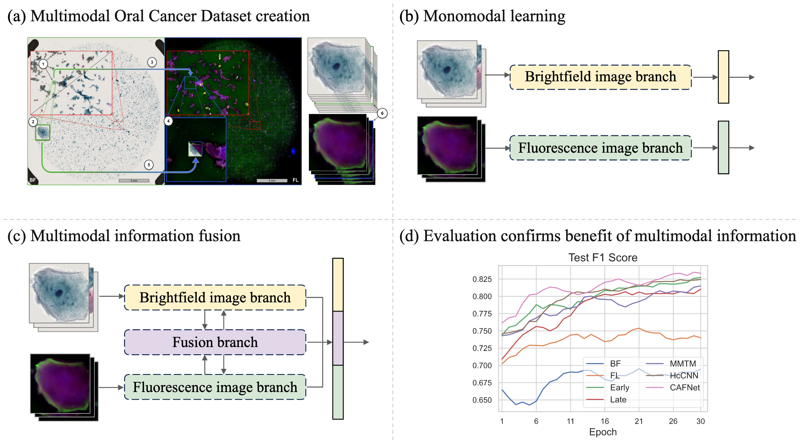

# LetItShine

## Let it shine: Autofluorescence of Papanicolaou-stain improves AI-based cytological oral cancer detection
Wenyi Lian, Joakim Lindblad, Christina Runow Stark, Jan-Michaél Hirsch, Nataša Sladoje

[[`Journal Link`](https://www.sciencedirect.com/science/article/pii/S001048252401583X)] [[`BibTeX`](#Citations)] [[`Preprint`](https://arxiv.org/abs/2407.01869)]

Links to data to appear shortly.

## Graphical Abstract

<p align="center">
     <br>

  *Graphical Abstract of LetItShine papaer.*

</p>

## Installation

1. Download the code and navigate to the project directory:
```
git clone https://github.com/MIDA-group/LetItShine.git
cd LetItShine
```

2. Set up the environment with all required dependencies:

```Shell
conda env create -f environment.yml
conda activate shine
```

## Training
This code automatically logs metrics for each fold and epoch using **Weights & Biases (wandb)**. The logged metrics include:

- **Accuracy**
- **F1 Score**
- **Precision**
- **Recall**
- **ROC AUC Score**

By default, the training process integrates with wandb to help you monitor your experiments effectively.

---
## Basic Training Commands

Here are the simplest commands to start training with different configurations. These commands are provided as quick-start examples. You can customize the training process further by including additional optional arguments listed in the table below.

### 1. Train with Brightfield (BF) Images Only
```
python main.py --mode BF --channel 3 --mixup --retrain
```
### 2. Train with Fluorescence (FL) Images Only
```
python main.py --mode FL --channel 4 --mixup --retrain
```
### 3. Train with Early Fusion of Two Modalities
```
python main.py --mode MM --channel 7 --fusion_mode E --mixup --retrain
```
### 4. Train with Late Fusion of Two Modalities
```
python main.py --mode MM --channel 7 --fusion_mode L --mixup --retrain
```
### 5. Train with MMTM (Multimodal Transfer Module)
```
python main.py --name mmtm --mode MM --channel 7 --fusion_mode I --mixup --retrain
```
### 6. Train with HcCNN (Hyper-connected Convolutional Neural Network)
```
python main.py --name hccnn --mode MM --channel 7 --fusion_mode I --mixup --retrain
```
### 7. Train with CAFNet (Co-Attention Fusion Network)
```
python main.py --batch_size 128 --name cafnet --mode MM --channel 7 --fusion_mode I --mixup --retrain
```

---
## Optional Arguments

| **Argument**       | **Default** | **Description**                                                                                   |
|---------------------|-------------|---------------------------------------------------------------------------------------------------|
| `--crop_size`       | `224`       | Crop size for input images (e.g., `224x224`).                                                    |
| `--epochs`          | `30`        | Number of training epochs.                                                                       |
| `--batch_size`      | `256`       | Number of samples per batch.                                                                     |
| `--lr`              | `8e-5`      | Learning rate for the optimizer.                                                                 |
| `--name`            | `resnet50`  | Model name. Options: `[resnet50]` for single model, `[cafnet, hccnn, mmtm]` for intermediate fusion. |
| `--mode`            | `MM`        | Input mode. Options: `[BF, FL, MM]`. MM indicates multi-modal inputs.                           |
| `--channel`         | `7`         | Number of input channels. Options: `3` for BF, `4` for FL, and `7` for MM.                      |
| `--fold`            | `0`         | Fold number for cross-validation. Options: `[0, 1, 2]`.                                          |
| `--run_name`        | `early_fusion` | Run name to identify the experiment.                                                            |
| `--fusion_mode`     | `E`         | Fusion mode for multi-modal inputs. Options: `[E, L, I]`.                                        |
| `--mixup`           | `True`     | Enable mixup augmentation. Use `--mixup` to activate.                                            |
| `--retrain`         | `True`     | Enable retraining with the validation set. Use `--retrain` to activate.                         |
| ~~`--CL`~~              | ~~`False`~~     | ~~Enable contrastive learning. Use `--CL` to activate. Ignore this one.~~                                             |
| ~~`--pretrained`~~      | ~~`False`~~ | ~~Use a pretrained model. Use `--pretrained` to activate. Ignore this one.~~                                          |
| ~~`--freeze`~~          | ~~`False`~~     | ~~Freeze weights during training. Use `--freeze` to activate. Ignore this one.~~                                    |
| `--wd`              | `0.1`       | Weight decay for regularization.                                                                |

You can customize your training process further by combining these optional arguments with the basic training commands. For example:
```
python main.py --mode BF --batch_size 128 --lr 1e-4 --epochs 50 --mixup --channel 3
```

## Citations
If our code helps your research or work, please consider citing our paper.
The following are BibTeX references:

```
@article{lian2025let,
  title={Let it shine: Autofluorescence of Papanicolaou-stain improves AI-based cytological oral cancer detection},
  author={Lian, Wenyi and Lindblad, Joakim and Stark, Christina Runow and Hirsch, Jan-Micha{\'e}l and Sladoje, Nata{\v{s}}a},
  journal={Computers in Biology and Medicine},
  volume={185},
  pages={109498},
  year={2025},
  publisher={Elsevier}
}
```

## Contact
Thanks for your interest! If you have questions please contect: wenyi.lian@it.uu.se
